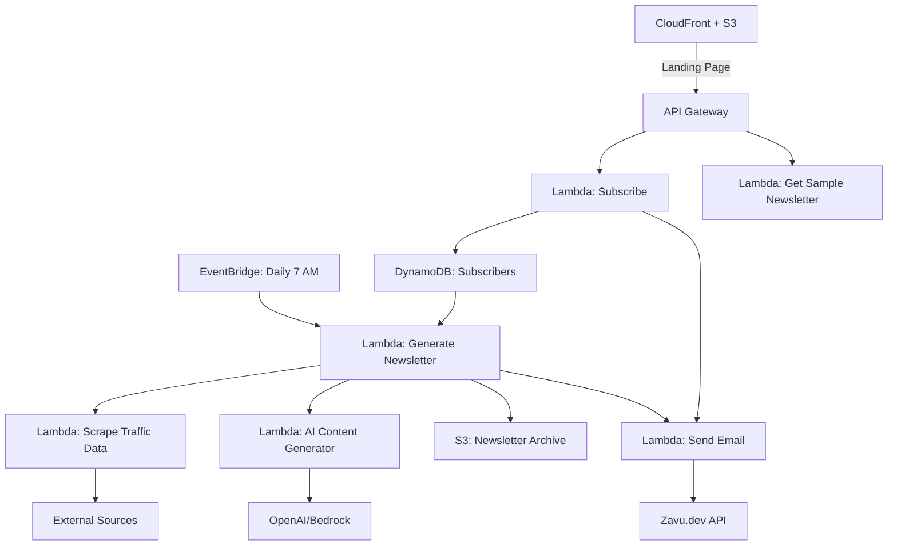
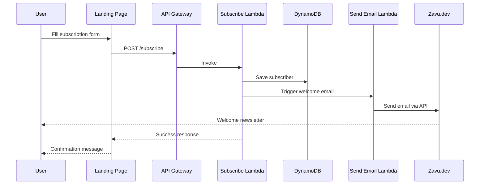
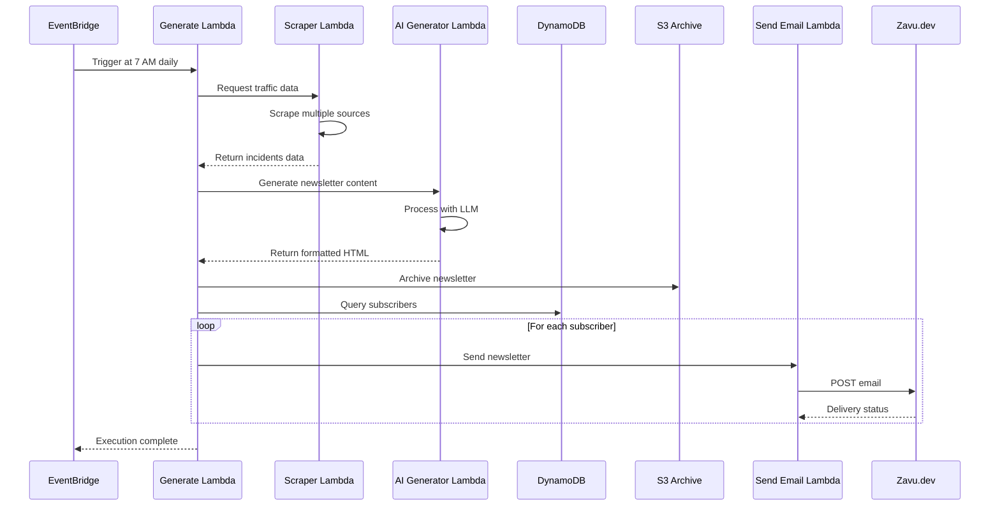
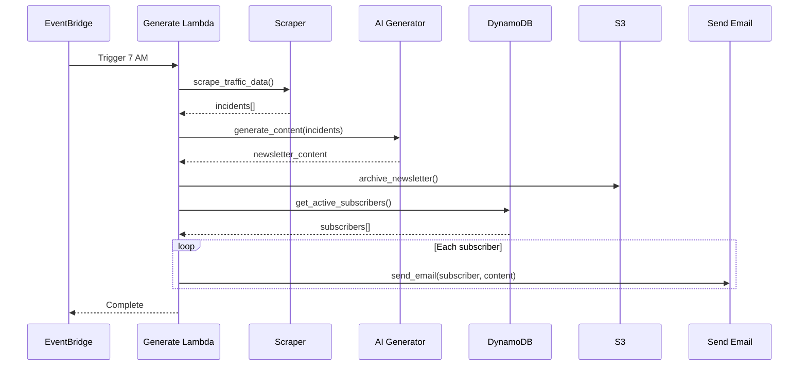

# Design Document: CDMX Traffic Newsletter

## Overview

Sistema automatizado de newsletter que recopila información sobre incidentes viales, baches y manifestaciones en Ciudad de México mediante web scraping e IA. La arquitectura serverless en AWS con Python permite enviar newsletters personalizadas (diarias o semanales) a suscriptores a través de Zavu.dev. El sistema incluye una landing page con ejemplos de newsletters anteriores y envía automáticamente un newsletter de bienvenida al suscribirse, además de envíos programados diarios a las 7 AM.

## Architecture



## Sequence Diagrams

### Subscription Flow




### Daily Newsletter Generation Flow



## Components and Interfaces

### Component 1: Subscribe Lambda

**Purpose**: Maneja suscripciones de usuarios y envía newsletter de bienvenida

**Interface**:
```python
from typing import Dict, Any
from dataclasses import dataclass
from enum import Enum

class Frequency(Enum):
    DAILY = "daily"
    WEEKLY = "weekly"

@dataclass
class SubscribeRequest:
    email: str
    frequency: Frequency
    name: str = ""

@dataclass
class SubscribeResponse:
    success: bool
    message: str
    subscriber_id: str = None

def lambda_handler(event: Dict[str, Any], context: Any) -> Dict[str, Any]:
    """
    Handles subscription requests
    """
    pass
```

**Responsibilities**:
- Validar email y frecuencia
- Guardar suscriptor en DynamoDB
- Triggear envío de newsletter de bienvenida
- Retornar confirmación


### Component 2: Scraper Lambda

**Purpose**: Recopila información de incidentes viales de múltiples fuentes

**Interface**:
```python
from typing import List, Dict
from dataclasses import dataclass
from datetime import datetime

@dataclass
class TrafficIncident:
    type: str  # "accident", "pothole", "protest"
    location: str
    description: str
    severity: str  # "low", "medium", "high"
    timestamp: datetime
    source: str

@dataclass
class ScraperResponse:
    incidents: List[TrafficIncident]
    scraped_at: datetime
    sources_count: int

def lambda_handler(event: Dict[str, Any], context: Any) -> Dict[str, Any]:
    """
    Scrapes traffic data from multiple sources
    """
    pass
```

**Responsibilities**:
- Scraping de sitios web de tráfico CDMX
- Normalizar datos de diferentes fuentes
- Clasificar incidentes por tipo y severidad
- Retornar datos estructurados

### Component 3: AI Content Generator Lambda

**Purpose**: Genera contenido del newsletter usando IA

**Interface**:
```python
from typing import List
from dataclasses import dataclass

@dataclass
class NewsletterContent:
    html_body: str
    text_body: str
    subject: str
    summary: str
    highlights: List[str]

def lambda_handler(event: Dict[str, Any], context: Any) -> Dict[str, Any]:
    """
    Generates newsletter content using AI
    """
    pass
```

**Responsibilities**:
- Procesar incidentes con LLM (OpenAI/Bedrock)
- Generar resumen ejecutivo
- Crear HTML formateado
- Priorizar incidentes más relevantes


### Component 4: Generate Newsletter Lambda

**Purpose**: Orquesta la generación y envío del newsletter diario

**Interface**:
```python
from typing import List, Dict
from dataclasses import dataclass

@dataclass
class NewsletterJob:
    job_id: str
    execution_time: datetime
    subscribers_count: int
    status: str

def lambda_handler(event: Dict[str, Any], context: Any) -> Dict[str, Any]:
    """
    Orchestrates newsletter generation and distribution
    """
    pass
```

**Responsibilities**:
- Invocar scraper para obtener datos
- Invocar AI generator para crear contenido
- Archivar newsletter en S3
- Consultar suscriptores activos
- Triggear envío de emails

### Component 5: Send Email Lambda

**Purpose**: Envía emails a través de Zavu.dev API

**Interface**:
```python
from typing import Dict
from dataclasses import dataclass

@dataclass
class EmailRequest:
    to_email: str
    to_name: str
    subject: str
    html_body: str
    text_body: str
    newsletter_type: str  # "welcome" or "daily"

@dataclass
class EmailResponse:
    success: bool
    message_id: str
    error: str = None

def lambda_handler(event: Dict[str, Any], context: Any) -> Dict[str, Any]:
    """
    Sends emails via Zavu.dev API
    """
    pass
```

**Responsibilities**:
- Integración con Zavu.dev API
- Manejo de rate limits
- Retry logic para fallos
- Logging de entregas


### Component 6: Get Sample Newsletter Lambda

**Purpose**: Retorna newsletter de ejemplo para mostrar en landing page

**Interface**:
```python
from typing import Dict

def lambda_handler(event: Dict[str, Any], context: Any) -> Dict[str, Any]:
    """
    Returns latest newsletter from S3 archive
    """
    pass
```

**Responsibilities**:
- Obtener último newsletter de S3
- Retornar HTML para preview
- Cache de respuesta

## Data Models

### Model 1: Subscriber

```python
from dataclasses import dataclass
from datetime import datetime
from typing import Optional

@dataclass
class Subscriber:
    subscriber_id: str  # UUID
    email: str
    name: str
    frequency: str  # "daily" or "weekly"
    subscribed_at: datetime
    last_sent_at: Optional[datetime]
    active: bool
    unsubscribe_token: str
```

**Validation Rules**:
- email debe ser válido (regex pattern)
- frequency debe ser "daily" o "weekly"
- subscriber_id debe ser UUID v4
- email debe ser único en la tabla

### Model 2: TrafficIncident

```python
from dataclasses import dataclass
from datetime import datetime

@dataclass
class TrafficIncident:
    incident_id: str  # UUID
    type: str  # "accident", "pothole", "protest"
    location: str
    description: str
    severity: str  # "low", "medium", "high"
    timestamp: datetime
    source: str
    coordinates: Optional[tuple[float, float]]  # (lat, lon)
```

**Validation Rules**:
- type debe estar en ["accident", "pothole", "protest"]
- severity debe estar en ["low", "medium", "high"]
- location no puede estar vacío
- timestamp debe ser válido


### Model 3: Newsletter

```python
from dataclasses import dataclass
from datetime import datetime
from typing import List

@dataclass
class Newsletter:
    newsletter_id: str  # UUID
    created_at: datetime
    subject: str
    html_body: str
    text_body: str
    incidents_count: int
    s3_key: str
    sent_count: int
```

**Validation Rules**:
- newsletter_id debe ser UUID v4
- html_body y text_body no pueden estar vacíos
- s3_key debe seguir formato: newsletters/YYYY/MM/DD/{newsletter_id}.html

## Main Algorithm/Workflow



## Key Functions with Formal Specifications

### Function 1: validate_and_save_subscriber()

```python
def validate_and_save_subscriber(
    email: str, 
    frequency: str, 
    name: str = ""
) -> SubscribeResponse:
    """
    Validates and saves a new subscriber to DynamoDB
    """
    pass
```

**Preconditions:**
- `email` is non-null and non-empty string
- `frequency` is either "daily" or "weekly"
- DynamoDB table exists and is accessible

**Postconditions:**
- Returns SubscribeResponse with success=True if subscriber saved
- Subscriber record exists in DynamoDB with unique subscriber_id
- If email already exists, returns success=False with appropriate message
- unsubscribe_token is generated and stored

**Loop Invariants:** N/A


### Function 2: scrape_traffic_sources()

```python
def scrape_traffic_sources() -> List[TrafficIncident]:
    """
    Scrapes multiple traffic data sources and returns normalized incidents
    """
    pass
```

**Preconditions:**
- Network connectivity available
- Target websites are accessible
- Scraping libraries (BeautifulSoup, requests) are available

**Postconditions:**
- Returns list of TrafficIncident objects
- All incidents have valid type, location, and severity
- Duplicates are removed based on location and timestamp proximity
- Empty list returned if all sources fail (with logging)

**Loop Invariants:**
- For each source iteration: all previously scraped incidents remain valid
- Incident count is monotonically increasing or stays same

### Function 3: generate_newsletter_with_ai()

```python
def generate_newsletter_with_ai(
    incidents: List[TrafficIncident]
) -> NewsletterContent:
    """
    Generates newsletter content using AI/LLM
    """
    pass
```

**Preconditions:**
- `incidents` is a valid list (may be empty)
- AI service (OpenAI/Bedrock) is accessible
- API credentials are configured

**Postconditions:**
- Returns NewsletterContent with non-empty html_body and text_body
- Subject line is generated and relevant to content
- If incidents list is empty, generates "No incidents today" message
- HTML is properly formatted and sanitized
- Highlights list contains 3-5 most important items

**Loop Invariants:** N/A

### Function 4: send_email_via_zavu()

```python
def send_email_via_zavu(
    to_email: str,
    subject: str,
    html_body: str,
    text_body: str
) -> EmailResponse:
    """
    Sends email through Zavu.dev API
    """
    pass
```

**Preconditions:**
- `to_email` is valid email format
- `subject`, `html_body`, `text_body` are non-empty
- Zavu API key is configured
- Zavu API is accessible

**Postconditions:**
- Returns EmailResponse with success=True if email sent
- message_id is populated on success
- On failure, error field contains descriptive message
- Retries up to 3 times on transient failures
- Logs all attempts

**Loop Invariants:**
- For retry loop: attempt count increases by 1 each iteration
- Maximum 3 attempts are made


### Function 5: get_active_subscribers_by_frequency()

```python
def get_active_subscribers_by_frequency(
    frequency: str
) -> List[Subscriber]:
    """
    Retrieves active subscribers for given frequency
    """
    pass
```

**Preconditions:**
- `frequency` is "daily" or "weekly"
- DynamoDB table exists and is accessible
- GSI on frequency+active exists

**Postconditions:**
- Returns list of Subscriber objects where active=True and frequency matches
- List is sorted by subscribed_at (oldest first)
- Empty list returned if no subscribers match
- All returned subscribers have valid email addresses

**Loop Invariants:**
- For pagination loop: all retrieved subscribers meet filter criteria
- No duplicate subscribers in result list

## Algorithmic Pseudocode

### Main Newsletter Generation Algorithm

```python
def generate_and_send_daily_newsletter():
    """
    Main algorithm for daily newsletter generation and distribution
    
    Preconditions:
    - All Lambda functions are deployed and accessible
    - DynamoDB table has active subscribers
    - External data sources are available
    
    Postconditions:
    - Newsletter is generated and archived in S3
    - All daily subscribers receive the newsletter
    - Execution metrics are logged
    
    Loop Invariants:
    - For subscriber iteration: all previously processed subscribers have been sent email
    - Email send count matches number of processed subscribers
    """
    # Step 1: Scrape traffic data
    incidents = scrape_traffic_sources()
    assert isinstance(incidents, list), "Incidents must be a list"
    
    # Step 2: Generate newsletter content with AI
    content = generate_newsletter_with_ai(incidents)
    assert content.html_body != "", "HTML body must not be empty"
    assert content.text_body != "", "Text body must not be empty"
    
    # Step 3: Archive newsletter in S3
    newsletter_id = str(uuid.uuid4())
    s3_key = f"newsletters/{datetime.now().strftime('%Y/%m/%d')}/{newsletter_id}.html"
    archive_newsletter_to_s3(s3_key, content.html_body)
    
    # Step 4: Get active daily subscribers
    subscribers = get_active_subscribers_by_frequency("daily")
    
    # Step 5: Send emails to all subscribers
    sent_count = 0
    failed_count = 0
    
    for subscriber in subscribers:
        # Loop invariant: sent_count + failed_count == number of processed subscribers
        assert sent_count + failed_count == subscribers.index(subscriber)
        
        response = send_email_via_zavu(
            to_email=subscriber.email,
            subject=content.subject,
            html_body=content.html_body,
            text_body=content.text_body
        )
        
        if response.success:
            sent_count += 1
            update_subscriber_last_sent(subscriber.subscriber_id)
        else:
            failed_count += 1
            log_send_failure(subscriber.subscriber_id, response.error)
    
    # Post-condition: all subscribers processed
    assert sent_count + failed_count == len(subscribers)
    
    # Step 6: Log execution metrics
    log_newsletter_metrics(newsletter_id, sent_count, failed_count, len(incidents))
    
    return {
        "newsletter_id": newsletter_id,
        "sent_count": sent_count,
        "failed_count": failed_count,
        "incidents_count": len(incidents)
    }
```


### Subscription Algorithm

```python
def handle_subscription_request(email: str, frequency: str, name: str = ""):
    """
    Handles new subscription requests
    
    Preconditions:
    - email is non-empty string
    - frequency is "daily" or "weekly"
    - DynamoDB table is accessible
    
    Postconditions:
    - Subscriber is saved in DynamoDB if email is valid and unique
    - Welcome newsletter is sent if subscription successful
    - Returns success response with subscriber_id or error message
    
    Loop Invariants: N/A
    """
    # Step 1: Validate email format
    if not is_valid_email(email):
        return SubscribeResponse(
            success=False,
            message="Invalid email format"
        )
    
    # Step 2: Check if email already exists
    existing = get_subscriber_by_email(email)
    if existing is not None:
        if existing.active:
            return SubscribeResponse(
                success=False,
                message="Email already subscribed"
            )
        else:
            # Reactivate subscription
            reactivate_subscriber(existing.subscriber_id, frequency)
            send_welcome_newsletter(email, name)
            return SubscribeResponse(
                success=True,
                message="Subscription reactivated",
                subscriber_id=existing.subscriber_id
            )
    
    # Step 3: Create new subscriber
    subscriber_id = str(uuid.uuid4())
    unsubscribe_token = generate_unsubscribe_token()
    
    subscriber = Subscriber(
        subscriber_id=subscriber_id,
        email=email,
        name=name,
        frequency=frequency,
        subscribed_at=datetime.now(),
        last_sent_at=None,
        active=True,
        unsubscribe_token=unsubscribe_token
    )
    
    # Step 4: Save to DynamoDB
    save_subscriber_to_db(subscriber)
    
    # Step 5: Send welcome newsletter
    send_welcome_newsletter(email, name)
    
    # Post-condition: subscriber exists in database
    assert get_subscriber_by_id(subscriber_id) is not None
    
    return SubscribeResponse(
        success=True,
        message="Subscription successful",
        subscriber_id=subscriber_id
    )
```


### Traffic Data Scraping Algorithm

```python
def scrape_traffic_sources() -> List[TrafficIncident]:
    """
    Scrapes multiple traffic data sources
    
    Preconditions:
    - Network connectivity available
    - Scraping libraries installed
    - Target URLs are configured
    
    Postconditions:
    - Returns list of normalized TrafficIncident objects
    - Duplicates are removed
    - All incidents have valid required fields
    - Empty list if all sources fail
    
    Loop Invariants:
    - For source iteration: all incidents from previous sources are valid
    - Incident list size is monotonically increasing
    """
    all_incidents = []
    sources = [
        "https://data.cdmx.gob.mx/trafico",  # Example source
        "https://twitter.com/OVIALCDMX",      # Example source
        # Add more sources
    ]
    
    for source_url in sources:
        # Loop invariant: all incidents in all_incidents are valid
        assert all(is_valid_incident(inc) for inc in all_incidents)
        
        try:
            # Scrape source
            raw_data = fetch_source_data(source_url)
            
            # Parse and normalize
            incidents = parse_traffic_data(raw_data, source_url)
            
            # Validate each incident
            for incident in incidents:
                if is_valid_incident(incident):
                    all_incidents.append(incident)
                else:
                    log_invalid_incident(incident, source_url)
        
        except Exception as e:
            log_scraping_error(source_url, str(e))
            continue  # Try next source
    
    # Step 2: Remove duplicates
    unique_incidents = deduplicate_incidents(all_incidents)
    
    # Step 3: Sort by severity and timestamp
    sorted_incidents = sort_incidents_by_priority(unique_incidents)
    
    # Post-condition: all returned incidents are valid and unique
    assert all(is_valid_incident(inc) for inc in sorted_incidents)
    assert len(sorted_incidents) == len(set(inc.incident_id for inc in sorted_incidents))
    
    return sorted_incidents


def deduplicate_incidents(incidents: List[TrafficIncident]) -> List[TrafficIncident]:
    """
    Removes duplicate incidents based on location and time proximity
    
    Preconditions:
    - incidents is a valid list
    
    Postconditions:
    - Returns list with no duplicates
    - Original order is preserved for non-duplicates
    
    Loop Invariants:
    - For each iteration: seen incidents are unique
    - Result list contains no duplicates
    """
    seen = set()
    unique = []
    
    for incident in incidents:
        # Create fingerprint: location + rounded timestamp
        fingerprint = create_incident_fingerprint(incident)
        
        # Loop invariant: all incidents in unique list are unique
        assert len(unique) == len(seen)
        
        if fingerprint not in seen:
            seen.add(fingerprint)
            unique.append(incident)
    
    # Post-condition: no duplicates in result
    assert len(unique) == len(seen)
    
    return unique
```


### AI Content Generation Algorithm

```python
def generate_newsletter_with_ai(incidents: List[TrafficIncident]) -> NewsletterContent:
    """
    Generates newsletter content using AI
    
    Preconditions:
    - incidents is a valid list (may be empty)
    - AI service credentials are configured
    - AI service is accessible
    
    Postconditions:
    - Returns NewsletterContent with non-empty html_body and text_body
    - Content is relevant to incidents provided
    - HTML is properly formatted and safe
    
    Loop Invariants: N/A
    """
    # Step 1: Handle empty incidents case
    if len(incidents) == 0:
        return create_no_incidents_newsletter()
    
    # Step 2: Prepare incident summary for AI
    incident_summary = format_incidents_for_ai(incidents)
    
    # Step 3: Create AI prompt
    prompt = f"""
    Genera un newsletter atractivo sobre incidentes viales en CDMX.
    
    Datos de incidentes:
    {incident_summary}
    
    El newsletter debe incluir:
    1. Título llamativo
    2. Resumen ejecutivo (2-3 líneas)
    3. Sección de incidentes más importantes
    4. Recomendaciones para conductores
    5. Tono profesional pero accesible
    
    Formato: HTML bien estructurado
    """
    
    # Step 4: Call AI service
    ai_response = call_ai_service(prompt)
    assert ai_response is not None, "AI service must return response"
    
    # Step 5: Parse AI response
    html_body = extract_html_from_response(ai_response)
    text_body = html_to_text(html_body)
    subject = extract_subject_from_response(ai_response)
    
    # Step 6: Generate highlights
    highlights = extract_top_highlights(incidents, max_count=5)
    
    # Step 7: Create summary
    summary = create_executive_summary(incidents)
    
    # Post-conditions
    assert html_body != "", "HTML body must not be empty"
    assert text_body != "", "Text body must not be empty"
    assert subject != "", "Subject must not be empty"
    assert len(highlights) > 0, "Must have at least one highlight"
    
    return NewsletterContent(
        html_body=html_body,
        text_body=text_body,
        subject=subject,
        summary=summary,
        highlights=highlights
    )
```

## Example Usage

### Example 1: Subscription Flow

```python
# User subscribes via landing page
request = {
    "email": "usuario@example.com",
    "frequency": "daily",
    "name": "Juan Pérez"
}

# Lambda handler processes subscription
response = handle_subscription_request(
    email=request["email"],
    frequency=request["frequency"],
    name=request["name"]
)

if response.success:
    print(f"Suscripción exitosa: {response.subscriber_id}")
    # Welcome newsletter is automatically sent
else:
    print(f"Error: {response.message}")
```


### Example 2: Daily Newsletter Generation

```python
# EventBridge triggers at 7 AM daily
def lambda_handler(event, context):
    # Generate and send newsletter
    result = generate_and_send_daily_newsletter()
    
    print(f"Newsletter {result['newsletter_id']} sent")
    print(f"Sent: {result['sent_count']}, Failed: {result['failed_count']}")
    print(f"Incidents: {result['incidents_count']}")
    
    return {
        "statusCode": 200,
        "body": json.dumps(result)
    }
```

### Example 3: Scraping Traffic Data

```python
# Scrape traffic data
incidents = scrape_traffic_sources()

# Process results
for incident in incidents:
    print(f"{incident.type.upper()}: {incident.location}")
    print(f"Severity: {incident.severity}")
    print(f"Description: {incident.description}")
    print("---")

# Example output:
# ACCIDENT: Insurgentes Sur y Eje 7
# Severity: high
# Description: Choque múltiple, 3 carriles cerrados
# ---
# POTHOLE: Periférico Norte km 15
# Severity: medium
# Description: Bache grande en carril central
```

### Example 4: Sending Email via Zavu

```python
# Send newsletter email
response = send_email_via_zavu(
    to_email="usuario@example.com",
    subject="🚦 Tu Newsletter Diario de Tráfico CDMX",
    html_body=newsletter_html,
    text_body=newsletter_text
)

if response.success:
    print(f"Email sent: {response.message_id}")
else:
    print(f"Failed to send: {response.error}")
```

### Example 5: Getting Sample Newsletter for Landing Page

```python
# API Gateway endpoint: GET /sample-newsletter
def lambda_handler(event, context):
    # Get latest newsletter from S3
    latest_newsletter = get_latest_newsletter_from_s3()
    
    return {
        "statusCode": 200,
        "headers": {
            "Content-Type": "text/html",
            "Access-Control-Allow-Origin": "*"
        },
        "body": latest_newsletter
    }
```

## Correctness Properties

*A property is a characteristic or behavior that should hold true across all valid executions of a system-essentially, a formal statement about what the system should do. Properties serve as the bridge between human-readable specifications and machine-verifiable correctness guarantees.*

### Property 1: Unique Subscriber Creation

*For any* valid email and frequency, when a subscription is created, the System should generate a unique subscriber_id and store the subscriber record.

**Validates: Requirements 1.1**

### Property 2: Email Format Validation

*For any* string that does not match valid email format, the System should reject the subscription request and return an error message.

**Validates: Requirements 1.2, 9.1**

### Property 3: Email Uniqueness

*For any* two active subscribers, if they have the same email address, they must have the same subscriber_id (no duplicate active subscriptions).

**Validates: Requirements 1.3**

### Property 4: Subscription Reactivation

*For any* previously unsubscribed email, when resubscribing, the System should reactivate the existing subscriber record and update the frequency preference.

**Validates: Requirements 1.4**

### Property 5: Frequency Validation

*For any* frequency value, the System should only accept "daily" or "weekly" and reject all other values.

**Validates: Requirements 1.5, 9.2**

### Property 6: Welcome Newsletter on New Subscription

*For any* successful new subscription, the System should trigger a welcome newsletter send with type "welcome".

**Validates: Requirements 2.1, 2.3**

### Property 7: Welcome Newsletter on Reactivation

*For any* successful subscription reactivation, the System should trigger a welcome newsletter send.

**Validates: Requirements 2.2**

### Property 8: Subscription Persists Despite Email Failure

*For any* subscription where the welcome email fails to send, the subscriber record should remain active in the database.

**Validates: Requirements 2.4**

### Property 9: Incident Data Normalization

*For any* scraped data from any source, the Scraper should transform it into TrafficIncident format with all required fields populated (type, location, description, severity, timestamp, source).

**Validates: Requirements 3.2, 9.5**

### Property 10: Incident Type Validation

*For any* TrafficIncident created by the Scraper, the type field should be one of: "accident", "pothole", or "protest".

**Validates: Requirements 3.3, 9.3**

### Property 11: Incident Severity Validation

*For any* TrafficIncident created by the Scraper, the severity field should be one of: "low", "medium", or "high".

**Validates: Requirements 3.4, 9.4**

### Property 12: Scraper Resilience

*For any* set of configured data sources where one or more sources fail, the Scraper should continue processing remaining sources and return incidents from successful sources.

**Validates: Requirements 3.5**

### Property 13: Incident Deduplication

*For any* list of incidents with duplicates (based on location and timestamp proximity), the deduplication function should return a list where all incidents have unique fingerprints.

**Validates: Requirements 3.6**

### Property 14: Newsletter Content Completeness

*For any* list of traffic incidents (including empty list), the AI_Generator should produce NewsletterContent with non-empty html_body, text_body, and subject fields.

**Validates: Requirements 4.1, 4.2, 4.3, 9.6**

### Property 15: Newsletter Highlights Range

*For any* list of incidents with at least 3 incidents, the AI_Generator should extract between 3 and 5 highlights.

**Validates: Requirements 4.4**

### Property 16: HTML Sanitization

*For any* generated HTML content, the AI_Generator should ensure it contains no dangerous elements (script tags, inline event handlers, etc.).

**Validates: Requirements 4.6**

### Property 17: Newsletter Archive with Unique ID

*For any* generated newsletter, the System should archive it to S3 with a unique newsletter_id and proper S3 key format (newsletters/YYYY/MM/DD/{newsletter_id}.html).

**Validates: Requirements 5.4, 7.1, 7.2**

### Property 18: Daily Subscriber Filtering

*For any* query for active subscribers with frequency "daily", the System should return only subscribers where active=True and frequency="daily".

**Validates: Requirements 5.5**

### Property 19: Newsletter Delivery Completeness

*For any* list of active daily subscribers, the System should send the newsletter to each subscriber in the list.

**Validates: Requirements 5.6**

### Property 20: Timestamp Update on Send

*For any* subscriber who successfully receives a newsletter, the System should update their last_sent_at timestamp to the current time.

**Validates: Requirements 5.7**

### Property 21: Email Dual Format

*For any* email sent through the Email_Service, it should include both html_body and text_body in the API request to Zavu.

**Validates: Requirements 6.2**

### Property 22: Email Retry Logic

*For any* email send that fails, the Email_Service should retry exactly 3 times before giving up.

**Validates: Requirements 6.3**

### Property 23: Email Success Response

*For any* successful email send, the Email_Service should return a response containing a message_id from Zavu.

**Validates: Requirements 6.4**

### Property 24: Email Failure Logging

*For any* email that fails after all retries, the Email_Service should log the failure with subscriber_id and error details.

**Validates: Requirements 6.5, 10.3**

### Property 25: Archive Failure Doesn't Block Distribution

*For any* newsletter generation where S3 archiving fails after retries, the System should continue with email distribution to subscribers.

**Validates: Requirements 7.3**

### Property 26: Latest Newsletter Retrieval

*For any* request to get a sample newsletter, the System should return the newsletter with the most recent created_at timestamp from S3.

**Validates: Requirements 8.2**

### Property 27: CORS Headers in Response

*For any* sample newsletter response, the System should include Access-Control-Allow-Origin header.

**Validates: Requirements 8.3**

### Property 28: Content-Type Header

*For any* sample newsletter response, the System should include Content-Type: text/html header.

**Validates: Requirements 8.4**

### Property 29: Unique Unsubscribe Token

*For any* two subscribers, their unsubscribe_token values should be unique.

**Validates: Requirements 11.1**

### Property 30: Unsubscribe Link in Emails

*For any* newsletter email sent, the html_body should contain an unsubscribe link with the subscriber's unsubscribe_token.

**Validates: Requirements 11.2**

### Property 31: Unsubscribe Deactivates Subscriber

*For any* valid unsubscribe request with a valid token, the System should set the subscriber's active field to False.

**Validates: Requirements 11.3**

### Property 32: Inactive Subscribers Excluded

*For any* query for active subscribers, the System should not return subscribers where active=False.

**Validates: Requirements 11.4**

### Property 33: Unsubscribe Token Validation

*For any* unsubscribe request with an invalid or non-existent token, the System should reject the request.

**Validates: Requirements 11.5**

### Property 34: Subscriber Batch Processing

*For any* list of subscribers to process, the System should group them into batches of exactly 50 (except the last batch which may be smaller).

**Validates: Requirements 12.5**

### Property 35: Error Logging with Context

*For any* error that occurs in any component, the System should log an entry containing timestamp, component name, and error details.

**Validates: Requirements 10.1**

### Property 36: Scraping Error Logging

*For any* data source that fails during scraping, the System should log the source URL and error message.

**Validates: Requirements 10.2**

### Property 37: AI Failure Logging

*For any* AI service failure, the System should log the failure and indicate whether fallback was used.

**Validates: Requirements 10.4**

### Property 38: Newsletter Metrics Logging

*For any* completed newsletter generation, the System should log metrics including sent_count, failed_count, and incidents_count.

**Validates: Requirements 10.5**

## Error Handling

### Error Scenario 1: Scraping Source Unavailable

**Condition**: One or more traffic data sources are unreachable or return errors
**Response**: 
- Log error with source URL and error details
- Continue with other sources
- If all sources fail, generate newsletter with cached data or "no data available" message
**Recovery**: 
- Retry failed sources on next scheduled run
- Alert if sources fail for 3+ consecutive runs


### Error Scenario 2: AI Service Failure

**Condition**: OpenAI/Bedrock API is unavailable or returns errors
**Response**:
- Retry up to 3 times with exponential backoff
- If all retries fail, use template-based newsletter generation
- Log error and send alert to monitoring system
**Recovery**:
- Fallback to simple HTML template with incident list
- Next run will attempt AI generation again

### Error Scenario 3: Zavu Email Delivery Failure

**Condition**: Zavu API returns error or rate limit exceeded
**Response**:
- Retry with exponential backoff (3 attempts)
- If subscriber email fails, log failure and continue with next subscriber
- Track failed deliveries in DynamoDB
**Recovery**:
- Retry failed deliveries in next scheduled run
- If email fails 3+ times, mark subscriber as bounced

### Error Scenario 4: Invalid Email Format

**Condition**: User submits invalid email during subscription
**Response**:
- Return 400 error with message "Invalid email format"
- Do not save to database
- Log attempt for analytics
**Recovery**:
- User must resubmit with valid email

### Error Scenario 5: DynamoDB Throttling

**Condition**: DynamoDB read/write capacity exceeded
**Response**:
- Implement exponential backoff retry logic
- Use batch operations where possible
- Log throttling events
**Recovery**:
- Increase provisioned capacity if throttling persists
- Consider on-demand billing mode

### Error Scenario 6: S3 Archive Failure

**Condition**: Newsletter cannot be saved to S3
**Response**:
- Retry up to 3 times
- If fails, continue with email sending (newsletter still delivered)
- Log error and alert
**Recovery**:
- Archive will be missing but emails were sent
- Manual intervention may be needed to recover content

## Testing Strategy

### Unit Testing Approach

**Test Coverage Goals**: 80%+ code coverage for all Lambda functions

**Key Test Cases**:
- Email validation logic (valid/invalid formats)
- Incident deduplication algorithm
- Subscriber frequency filtering
- HTML sanitization
- Error handling paths

**Mocking Strategy**:
- Mock external APIs (Zavu, OpenAI, Bedrock)
- Mock AWS services (DynamoDB, S3)
- Use pytest with moto for AWS mocking

**Example Unit Test**:
```python
def test_validate_email():
    assert is_valid_email("user@example.com") == True
    assert is_valid_email("invalid-email") == False
    assert is_valid_email("") == False
    assert is_valid_email("user@") == False
```


### Property-Based Testing Approach

**Property Test Library**: Hypothesis (Python)

**Properties to Test**:

1. **Email Uniqueness Property**:
```python
from hypothesis import given, strategies as st

@given(st.lists(st.emails(), min_size=1, max_size=100))
def test_no_duplicate_active_subscribers(emails):
    """Property: No two active subscribers can have the same email"""
    for email in emails:
        handle_subscription_request(email, "daily")
    
    active_subscribers = get_all_active_subscribers()
    active_emails = [s.email for s in active_subscribers]
    
    # Property: all emails are unique
    assert len(active_emails) == len(set(active_emails))
```

2. **Incident Deduplication Property**:
```python
@given(st.lists(st.builds(TrafficIncident)))
def test_deduplication_removes_duplicates(incidents):
    """Property: Deduplication always produces unique incidents"""
    # Add some duplicates
    incidents_with_dupes = incidents + incidents[:len(incidents)//2]
    
    unique = deduplicate_incidents(incidents_with_dupes)
    
    # Property: result has no duplicates
    fingerprints = [create_incident_fingerprint(i) for i in unique]
    assert len(fingerprints) == len(set(fingerprints))
```

3. **Newsletter Generation Property**:
```python
@given(st.lists(st.builds(TrafficIncident), max_size=50))
def test_newsletter_always_has_content(incidents):
    """Property: Newsletter generation always produces valid content"""
    content = generate_newsletter_with_ai(incidents)
    
    # Properties: content is never empty
    assert content.html_body != ""
    assert content.text_body != ""
    assert content.subject != ""
    assert len(content.highlights) > 0
```

### Integration Testing Approach

**Test Scenarios**:

1. **End-to-End Subscription Flow**:
   - POST to /subscribe endpoint
   - Verify subscriber in DynamoDB
   - Verify welcome email sent via Zavu
   - Verify unsubscribe token generated

2. **Daily Newsletter Generation Flow**:
   - Trigger EventBridge rule manually
   - Verify scraping executes
   - Verify AI generation completes
   - Verify S3 archive created
   - Verify emails sent to all daily subscribers

3. **Sample Newsletter Retrieval**:
   - GET /sample-newsletter endpoint
   - Verify HTML returned
   - Verify CORS headers present

**Test Environment**:
- Use LocalStack for AWS services
- Use mock servers for external APIs
- Separate test DynamoDB table

## Performance Considerations

### Lambda Optimization

**Cold Start Mitigation**:
- Keep Lambda functions lightweight (<50MB)
- Use Lambda layers for shared dependencies
- Consider provisioned concurrency for critical functions

**Execution Time**:
- Subscribe Lambda: Target <1s
- Scraper Lambda: Target <30s (may need longer timeout)
- AI Generator Lambda: Target <15s
- Send Email Lambda: Target <3s per email
- Generate Newsletter Lambda: Target <5 minutes total

### DynamoDB Performance

**Table Design**:
- Partition key: subscriber_id
- GSI: frequency-active-index for efficient querying
- On-demand billing mode for unpredictable traffic

**Query Optimization**:
- Use batch operations for bulk reads
- Implement pagination for large result sets
- Cache frequently accessed data


### Email Sending Performance

**Batch Processing**:
- Process subscribers in batches of 50
- Use concurrent Lambda invocations for large subscriber lists
- Implement SQS queue for reliable email delivery

**Rate Limiting**:
- Respect Zavu API rate limits
- Implement exponential backoff
- Monitor API usage metrics

### Scraping Performance

**Concurrent Scraping**:
- Scrape multiple sources in parallel
- Use asyncio for concurrent HTTP requests
- Timeout individual sources after 10s

**Caching**:
- Cache scraped data for 5 minutes
- Reduce redundant scraping during testing

## Security Considerations

### API Security

**API Gateway**:
- Enable CORS with specific origins
- Implement rate limiting (100 requests/minute per IP)
- Use API keys for internal endpoints
- Enable AWS WAF for DDoS protection

**Input Validation**:
- Sanitize all user inputs
- Validate email format server-side
- Prevent SQL injection (use parameterized queries)
- Limit request payload size

### Data Protection

**Email Privacy**:
- Store emails encrypted at rest in DynamoDB
- Use KMS for encryption keys
- Implement secure unsubscribe mechanism
- GDPR compliance: allow data deletion

**Secrets Management**:
- Store API keys in AWS Secrets Manager
- Rotate secrets regularly
- Never log sensitive data
- Use IAM roles for Lambda permissions

### Authentication

**Unsubscribe Security**:
- Generate unique unsubscribe tokens (UUID)
- Tokens expire after 1 year
- Validate token before unsubscribing
- Rate limit unsubscribe endpoint

**Admin Access**:
- Separate admin API with authentication
- Use Cognito or API Gateway authorizers
- Audit log all admin actions

### Content Security

**HTML Sanitization**:
- Sanitize AI-generated HTML
- Prevent XSS attacks
- Use Content Security Policy headers
- Validate external links

**Scraping Ethics**:
- Respect robots.txt
- Implement rate limiting for scrapers
- Use appropriate User-Agent headers
- Cache data to reduce load on sources


## Dependencies

### AWS Services

- **Lambda**: Serverless compute for all functions
- **API Gateway**: REST API endpoints
- **DynamoDB**: Subscriber data storage
- **S3**: Newsletter archive and static website hosting
- **CloudFront**: CDN for landing page
- **EventBridge**: Scheduled triggers (daily 7 AM)
- **CloudWatch**: Logging and monitoring
- **Secrets Manager**: API key storage
- **IAM**: Permissions and roles
- **SAM**: Infrastructure as code

### External Services

- **Zavu.dev**: Email delivery service
  - API endpoint: https://api.zavu.dev/v1/email
  - Documentation: https://docs.zavu.dev/guides/email/setup
  - Authentication: API key
  
- **OpenAI API** (or AWS Bedrock): AI content generation
  - Model: GPT-4 or Claude
  - Purpose: Newsletter content generation

### Python Libraries

**Core Dependencies**:
```
boto3==1.28.0           # AWS SDK
requests==2.31.0        # HTTP client
beautifulsoup4==4.12.0  # Web scraping
lxml==4.9.3             # HTML parsing
pydantic==2.0.0         # Data validation
python-dateutil==2.8.2  # Date handling
```

**Testing Dependencies**:
```
pytest==7.4.0           # Test framework
hypothesis==6.82.0      # Property-based testing
moto==4.1.0             # AWS mocking
pytest-cov==4.1.0       # Coverage reporting
responses==0.23.0       # HTTP mocking
```

**Optional Dependencies**:
```
openai==0.27.0          # OpenAI API client
anthropic==0.3.0        # Claude API client (alternative)
selenium==4.10.0        # Dynamic scraping (if needed)
```

### Infrastructure Requirements

**SAM Template Structure**:
```
template.yaml           # Main SAM template
├── Functions
│   ├── SubscribeFunction
│   ├── ScraperFunction
│   ├── AIGeneratorFunction
│   ├── GenerateNewsletterFunction
│   ├── SendEmailFunction
│   └── GetSampleFunction
├── Resources
│   ├── SubscribersTable (DynamoDB)
│   ├── NewsletterBucket (S3)
│   ├── RestApi (API Gateway)
│   └── DailySchedule (EventBridge)
└── Outputs
    ├── ApiEndpoint
    ├── LandingPageUrl
    └── SubscribersTableName
```

**Environment Variables**:
```
ZAVU_API_KEY            # Zavu API key (from Secrets Manager)
OPENAI_API_KEY          # OpenAI API key (from Secrets Manager)
SUBSCRIBERS_TABLE       # DynamoDB table name
NEWSLETTER_BUCKET       # S3 bucket name
FROM_EMAIL              # Sender email address
ENVIRONMENT             # dev/staging/prod
```

### External Data Sources

**Traffic Data Sources** (examples):
- CDMX Open Data Portal
- Twitter/X: @OVIALCDMX, @SSP_CDMX
- Waze API (if available)
- Google Maps Traffic API
- Local news websites

**Note**: Actual sources need to be researched and validated during implementation.
