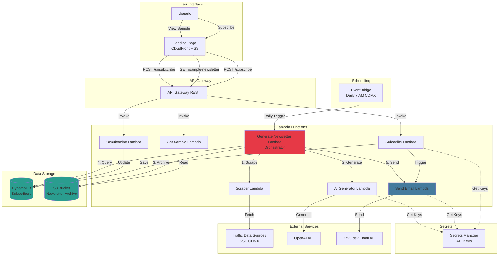

# CDMX Traffic Newsletter

Sistema automatizado de newsletter que recopila información sobre incidentes viales en Ciudad de México mediante web scraping e IA, y envía newsletters personalizadas a suscriptores.

## Arquitectura



## Stack Tecnológico

- **Infrastructure**: AWS SAM (Serverless Application Model)
- **Compute**: AWS Lambda (Python 3.11)
- **Storage**: DynamoDB, S3
- **API**: API Gateway REST
- **Scheduling**: EventBridge
- **Email**: Zavu.dev API
- **AI**: OpenAI API
- **Frontend**: Static HTML/CSS/JS on CloudFront + S3

## Estructura del Proyecto

```
.
├── template.yaml              # SAM infrastructure template
├── samconfig.toml            # SAM deployment configuration
├── requirements.txt          # Python dependencies
├── trigger-newsletter.sh     # Manual newsletter trigger script
├── src/
│   ├── shared/               # Shared models and utilities
│   ├── subscribe/            # Subscription Lambda
│   ├── unsubscribe/          # Unsubscribe Lambda
│   ├── send_email/           # Email sending Lambda (Zavu integration)
│   ├── scraper/              # Traffic data scraper Lambda
│   ├── ai_generator/         # AI content generator Lambda (OpenAI)
│   ├── generate_newsletter/  # Newsletter orchestrator Lambda
│   └── get_sample/           # Sample newsletter retrieval Lambda
└── .kiro/specs/             # Project specifications
```

## Requisitos Previos

1. **AWS CLI** configurado con credenciales
2. **AWS SAM CLI** instalado
3. **Python 3.11+**
4. **API Keys**:
   - [Zavu.dev](https://dashboard.zavu.dev) - Para envío de emails
   - [OpenAI](https://platform.openai.com) - Para generación de contenido con IA

## Instalación Rápida

### 1. Instalar AWS SAM CLI

```bash
# macOS
brew install aws-sam-cli

# Linux/Windows
pip install aws-sam-cli
```

### 2. Configurar AWS CLI

```bash
aws configure
# Ingresa tu AWS Access Key ID, Secret Access Key y región (us-east-1)
```

### 3. Desplegar

```bash
# Build
sam build

# Deploy (primera vez)
sam deploy --guided

# Despliegues subsecuentes
sam deploy
```

### 4. Configurar API Keys

Después del primer despliegue, actualiza los secrets con tus API keys:

```bash
# Zavu.dev API Key
aws secretsmanager update-secret \
  --secret-id dev/cdmx-traffic/zavu-api-key \
  --secret-string '{"api_key":"TU_ZAVU_API_KEY"}'

# OpenAI API Key
aws secretsmanager update-secret \
  --secret-id dev/cdmx-traffic/openai-api-key \
  --secret-string '{"api_key":"TU_OPENAI_API_KEY"}'
```

### 5. Completar KYC en Zavu

Para enviar emails, debes completar la verificación KYC en [Zavu Dashboard](https://dashboard.zavu.dev/kyc) y configurar un sender profile.

## Uso

### Trigger Manual del Newsletter

```bash
# Generar newsletter para hoy
./trigger-newsletter.sh

# Generar newsletter para fecha específica
./trigger-newsletter.sh 2026-03-07
```

### Endpoints de API

Después del despliegue, obtendrás una URL de API Gateway:

```
POST   /subscribe           - Suscribirse al newsletter
GET    /sample-newsletter   - Obtener newsletter de ejemplo
POST   /unsubscribe         - Cancelar suscripción
```

### Ver Logs

```bash
# Logs de una función específica
sam logs -n GenerateNewsletterFunction --stack-name cdmx-traffic-newsletter --tail

# Logs en CloudWatch
aws logs tail /aws/lambda/dev-cdmx-traffic-generate-newsletter --follow
```

## Recursos de AWS Creados

- **Lambda Functions**: 7 funciones (Subscribe, Unsubscribe, GetSample, GenerateNewsletter, Scraper, AIGenerator, SendEmail)
- **DynamoDB Table**: `dev-cdmx-traffic-subscribers` con GSIs para email y frequency
- **S3 Buckets**: 
  - `dev-cdmx-traffic-newsletters` - Archivo de newsletters
  - `dev-cdmx-traffic-landing` - Landing page estática
- **API Gateway**: REST API con 3 endpoints
- **EventBridge Rule**: Trigger diario a las 7 AM (hora CDMX)
- **CloudFront Distribution**: CDN para landing page
- **Secrets Manager**: 2 secrets para API keys
- **IAM Role**: Rol de ejecución para Lambdas

## Flujo de Newsletter Diario

1. **EventBridge** dispara `GenerateNewsletterFunction` a las 7 AM
2. **Scraper Lambda** recopila datos de tráfico de fuentes públicas
3. **AI Generator Lambda** crea contenido del newsletter con OpenAI
4. **S3** archiva el newsletter generado
5. **DynamoDB** consulta suscriptores activos con frecuencia "daily"
6. **Send Email Lambda** envía el newsletter vía Zavu.dev
7. **DynamoDB** actualiza `last_sent_at` para cada suscriptor

## Desarrollo Local

```bash
# Invocar función localmente
sam local invoke SubscribeFunction -e events/subscribe.json

# Iniciar API local
sam local start-api

# Probar endpoint local
curl -X POST http://localhost:3000/subscribe \
  -H "Content-Type: application/json" \
  -d '{"email":"test@example.com","frequency":"daily"}'
```

## Testing

```bash
# Ejecutar tests
pytest src/

# Con coverage
pytest --cov=src tests/
```

## Limpieza

Para eliminar todos los recursos:

```bash
sam delete --stack-name cdmx-traffic-newsletter
```

## Configuración de Entornos

El proyecto soporta múltiples entornos (dev, staging, prod):

```bash
# Deploy a staging
sam deploy --config-env staging

# Deploy a producción
sam deploy --config-env prod
```

## Troubleshooting

### Emails no se envían

1. Verifica que completaste KYC en Zavu Dashboard
2. Verifica que el API key de Zavu está configurado correctamente
3. Revisa logs: `sam logs -n SendEmailFunction --tail`

### Newsletter sin incidentes

Las fuentes de datos pueden estar temporalmente no disponibles. El sistema genera un newsletter de "sin incidentes" como fallback.

### Lambda timeout

Si el scraper tarda mucho, ajusta el timeout en `template.yaml`:

```yaml
ScraperFunction:
  Properties:
    Timeout: 120  # Aumentar a 120 segundos
```

## Documentación Adicional

- [Especificaciones del Proyecto](.kiro/specs/cdmx-traffic-newsletter/)
- [AWS SAM Documentation](https://docs.aws.amazon.com/serverless-application-model/)
- [Zavu.dev API Docs](https://docs.zavu.dev/)

## Licencia

MIT

## Soporte

Para preguntas o problemas, consulta la documentación en `.kiro/specs/cdmx-traffic-newsletter/`.
